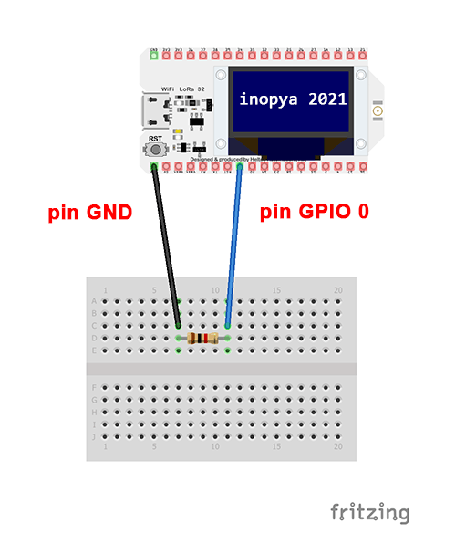

# Restablecer el bootloader en placas ESP32 y LoRa32
Solucion al error de no poder cargar codigo en placas ESP32/LoRa32 mediante cable USB desde Arduino IDE .

El error tipico suele ser:
*"A fatal error occurred: Failed to connect to ESP32: Timed out waiting for packet header"*

O algo  algo similar. Pero el resultado es siempre el mismo, tras un buen rato de ver apaecer puntos suspensivos en el monitor serie de nuestro IDE, el proceso de carga no puede completarse y nuestra placa permanece aparentemente "muerta"

No entremos en pánico. No hemos roto nada. Lo que ocurre es que nuestro ESP32 ha tenido un error durante la ultima carga de un sketch y se le ha dañado el bootloader que lo hace reconocible para el IDE de Arduino

# Primera opcion 
(NO es necesario ningun material extra)

  1) Conecta la placa por USB como haces normalmente para grabar un nuevo programa.
  2) Pulsa el boton de RESET de la placa ESP32/LoRa32 (y dejalo pulsado).
  3) Haz una subida de un sketch cualquiera ,que sepas que no tiene errores, a la placa (sigue manteniendo pulsado el boton de RESET)
  4) Estate atento a los mensajes que iran apareciendo por el monitor serie del IDE...  y cuando veas que empieza el proceso de carga (es decir cuando empieza a  mostrar los puntitos suspensivos y el porcentaje de carga), suelta el boton de reset.
  

Con algo de suerte esto te sacará del apuro. Aunque de entrada te digo que en la mayoría de los casos no funciona y hemos de pasar al plan B

# Segunda opcion
(Plan B, necesitaras una protoboard, una resistencia de 1k y un par de cables dupont)

  1) Pon una resistencia de 1k en la protoboad \* *nota1*
  2) Conecta un cable desde pin IO0 de tu ESP/Lora hasta un extremo de la resistencia.
  3) Conecta otro cable desde un pin GND de la placa hasta el otro extremo de la resistencia.
  4) Inicia el proceso de carga de un sketch cualquiera, por ejemplo un humilde "blink"

El programa deberia cargarse sin singun problema. Si no es así puedes realizar los pasos de la opcion 1 pero ahora con el puente resistivo establecido.
En el 90% de lo casos tu placa "resucitará". Ya que la hemos forzado a entrar en modo de programacion y en cada subida de nuevo codigo el IDE restablece el bootloader 
Por ese motivo a veces al producirse errores durante una subida, el boot se daña.

  \* *nota1: Podriamos hacer un puente directamente entre IO0 y GND, pero no sabemos a priori si ese pin por algun motivo ha quedado configurado como salida (y está activo) en cuyo caso estariamos provocando un cortocircuito. Es cierto que tambien podriamos medir con el multimetro la salida IO0, pero tambien podia existir en ella un PWM que "nos despieste".
  Así que nos curaremos en salud haciendo ese puente resistivo.*

Puente para forzar el modo programacion a nuestra placa

Si nada de esto funciona siempre nos queda la opcion de usar un adaptador/prorgamador FTDI para subir nuestro codigo. Una vez que subamos correctamente cualquier sketch, el bootloader quedará restaurado.

